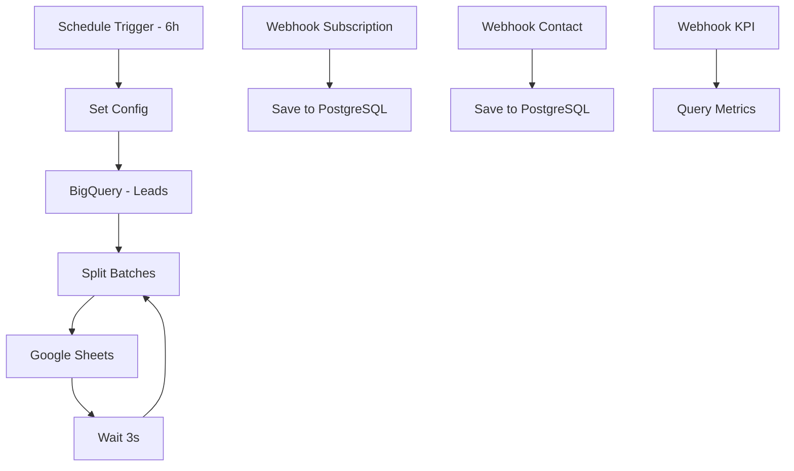

# n8n Workflows - AI Agents Platform

Workflows completos do n8n para replicar toda a funcionalidade do backend Node.js da plataforma de agentes de IA.

## 📁 Arquivos

- **`ai-agents-complete-workflow.json`** - Workflow principal completo
- **`environment-variables.md`** - Variáveis de ambiente necessárias  
- **`setup-instructions.md`** - Guia passo a passo de configuração

## 🎯 Funcionalidades Implementadas

### 1. Captura Automática de Leads
- **Trigger diário** às 6h (horário de Brasília)
- **Query BigQuery** na base `basedosdados.br_me_cnpj`
- **Processamento em lotes** de 300 registros
- **Delay de 3 segundos** entre lotes
- **Exportação para Google Sheets** automática

### 2. API REST via Webhooks
- **POST /webhook-subscription** - Criar assinatura
- **POST /webhook-contact** - Formulário de contato
- **GET /api/kpi/metrics** - Métricas e KPIs
- **POST /webhook-manual-trigger** - Trigger manual

### 3. Gestão de Dados
- **PostgreSQL** para assinaturas e contatos
- **Google Sheets** para leads capturados
- **Validação** e tratamento de erros

## 🚀 Como Usar

### 1. Importar no n8n
```bash
# No n8n interface
1. Workflows > Import from File
2. Selecione: ai-agents-complete-workflow.json
3. Confirme a importação
```

### 2. Configurar Credenciais
```bash
# Necessárias:
- Google Service Account (BigQuery)
- Google Sheets OAuth2 API  
- PostgreSQL Database
```

### 3. Definir Variáveis de Ambiente
```env
GOOGLE_PROJECT_ID=seu-projeto
GOOGLE_SHEETS_ID=sua-planilha
CNAE_DEFAULT=5611201
LEAD_CAPTURE_INTERVAL_DAYS=7
```

### 4. Ativar Workflow
- Ative o workflow no n8n
- Teste com trigger manual
- Monitore execuções automáticas

## 📊 Estrutura do Workflow



## 🔧 Configurações Personalizáveis

### CNAEs Populares
```env
CNAE_DEFAULT=5611201  # Restaurantes
CNAE_DEFAULT=4711302  # Supermercados  
CNAE_DEFAULT=6201501  # Software
```

### Filtros Geográficos
```env
UF_FILTER=SP  # Apenas São Paulo
UF_FILTER=RJ  # Apenas Rio de Janeiro
```

### Performance
```env
LEAD_CAPTURE_BATCH_SIZE=300    # Registros por lote
LEAD_CAPTURE_DELAY_SECONDS=3   # Delay entre lotes
LEAD_CAPTURE_LIMIT=10000       # Limite total
```

## 📈 Monitoramento

### Métricas Disponíveis
- Total de leads capturados
- Leads por período (hoje, semana, mês)
- Assinaturas por plano
- Taxa de conversão
- Performance do workflow

### Logs e Debugging
- Executions tab no n8n
- Error handling em cada nó
- Retry automático configurado

## 🔄 Integração com Frontend

### URLs dos Webhooks
Após ativar o workflow, use as URLs geradas:

```javascript
// Frontend API calls
const API_BASE = 'https://seu-n8n.com/webhook';

// Criar assinatura
fetch(`${API_BASE}/webhook-subscription`, {
  method: 'POST',
  body: JSON.stringify(subscriptionData)
});

// Obter KPIs  
fetch(`${API_BASE}/api/kpi/metrics`);
```

## 🚨 Troubleshooting

### Problemas Comuns
1. **Credenciais inválidas** - Verificar configuração OAuth2
2. **Limite de API** - Ajustar batch size e delays
3. **Planilha não encontrada** - Verificar ID e permissões
4. **Banco inacessível** - Verificar credenciais PostgreSQL

### Suporte
- Consulte `setup-instructions.md` para guia detalhado
- Verifique logs de execução no n8n
- Teste cada nó individualmente

## 📝 Vantagens vs Backend Node.js

### n8n Workflow
✅ **Interface visual** para edição
✅ **Deploy imediato** sem infraestrutura
✅ **Monitoramento integrado**
✅ **Retry automático** em falhas
✅ **Webhooks prontos** para uso

### Backend Node.js  
✅ **Controle total** do código
✅ **Performance otimizada**
✅ **Testes automatizados**
✅ **Integração com CI/CD**
✅ **Customização avançada**

Ambas as soluções são válidas - escolha baseada na sua preferência e necessidades!